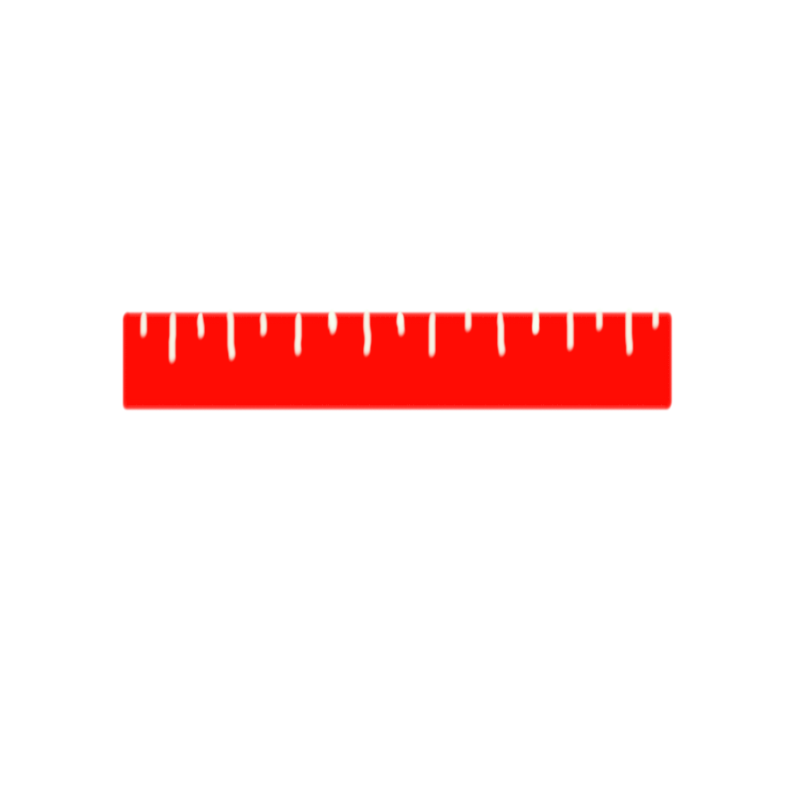

# Project-3
## CS 4331

# Demo Video
https://youtu.be/I9lbqiZxZhE

# ARruler

### Description
For project 3 I plan to make an app using ARKit that allows the user to accurately measure real world objects using AR. When the user taps the screen a sphere will start at the center of the screen and when the user moves the phone the line will extend to where the center of the screen is currently, marked with a second sphere. At the top of the screen will be displayed the distance measured in inches, centimeters, and meters. 

### Walkthrough 

When the application first opens the user needs to slowly move the device around so the camera can start to detect a plane in the real world. As indicated by the text in the bottom left of the screen. 

The yellow dots that will start to appear are called Feature Points they help the virtual objects that are placed stay were they are originally placed. They also show planes that the camera has detected. Once these yellow dots show up on the screen the user will be able to press the green start measuring button to start measuring.

Once the user presses the green start measuring button a red sphere will appear in the center of the screen on the same plane as the Feature Points. The green start measuring button will disappear and a red stop measuring button takes its place. When the user moves their phone a sphere will stay at the center of the screen with a line attached to it and the first sphere.

When the user reaches the end spot of their measurement with the center of the screen they can press the red stop measuring button to place the second sphere to mark the end of the measurement. Once they press the red stop measuring button the second red sphere will be placed where the center of the screen is on the same plane as the Feature Points. The red stop measuring button will be replaced with the green start measuring button and the distance between the two sphere will be recorded at the top of the screen in inches, centimeters, and meters. 

Once the user reads the measurement they can again move their camera to where they want to start a measurement and press the green start measurement button to start a new measurment. 

### Learned
- The basics of swift
- How to create an AR application in Xcode9

### Problems
- I was originally planning on having cones at the ends of the line to make a two-way arrow but I could not find a way for them to stay in the correct direction, so I ended up using spheres. 
- Getting the distance to display at the top of the screen
- Placing the spheres on planes

### Limitations
Since ARKit was introduced in Septemeber of 2017 it is still new. ARKit does not the ability to recognize real world objects or track moving real world objects. In the next update for ARKit they will have a new image detection feature but it will only find the image once so it could not be used to track a moving object. 

### Hardward target
In order to use augmented reality on iOS the devices must have an A9 processor or later as well as have iOS 11 or later installed the following list are devices that have the A9 processor
- iPhone SE
- iPhone 6S and iPhone 6S Plus
- iPhone 7 and iPhone 7 Plus
- iPhone 8 and iPhone 8 Plus
- iPhone X
- iPad (5th generation) and up
- iPad Pro (all models)

### Software used
- Xcode 9
- ARKit
- CocoaPods
  - LBTAComponents
    - This gives me more options for placing my buttons by allowing to anchor it to specific sides of the screen as well as adjust the size of it. When using it it creates a new project file (filename).xcworkspace 

### Language
- Swift

### Team
- Jakob Dozier

I created the buttons and the center plus icon (in the resources folder).

App icon that I created

